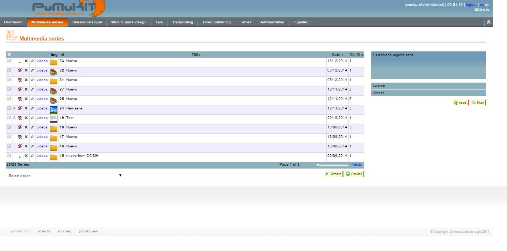
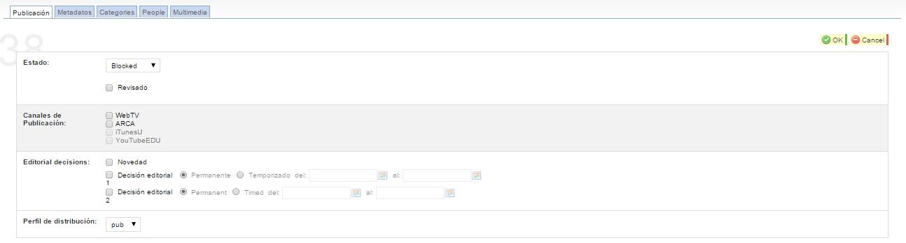
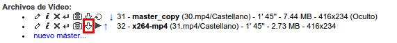

PuMuKIT User Guide
===================

# User manual and administration PuMuKIT

## Table of contents

1. <a href="#intro">General Introduction</a>

    1.1. <a href="#overview">What is PuMuKIT?</a>

    1.2. <a href="#terminology"> Terminology </a>

2. <a href="#user">User Manual PuMuKIT</a>

    2.1. <a href="#import">Import content</a>

    2.1.1. <a href="#mono">Manual import content mono-stream</a>

    2.1.2. <a href="#matterhorn">Importing videos from Matterhorn</a>

    2.1.2.1. <a href="#first">First video of the series</a>

    2.1.2.2. <a href="#more">More video of the series</a>

    2.1.2.3. <a href="#without">Videos without a series in Matterhorn</a>

    2.2. <a href="#metadata">Metadata edition</a>

    2.2.1. <a href="#seriesm">Series metadata edition</a>

    2.2.1.1. <a href="#seriesop">Edition of the series options</a>

    2.2.2. <a href="#objectm">Multimedia object metadata edition</a>

    2.2.2.1. <a href="#publication">Publication metadata</a>

    2.2.2.2. <a href="#descriptive">Descriptive and style metadata</a>

    2.2.2.3. <a href="#categories">Categories</a>

    2.2.2.4. <a href="#people">People</a>

    2.2.2.5. <a href="#tech">Technical metadata</a>

    2.2.2.5.1. <a href="#down">Download a copy of master and publishing a video mono-stream</a>

    2.2.3. <a href="#seriesed">Series and multimedia object image edition</a>

    2.3. <a href="#content">Content publication</a>

    2.4. <a href="#other">Other administrative tools</a>

    2.4.1. <a href="#access">Access module</a>

    2.4.2. <a href="#dash">Dashboard module</a>

    2.4.3. <a href="#seriesmod">Multimedia series module</a>

    2.4.4. <a href="#unesco">UNESCO cataloguer module</a>

    2.4.5. <a href="#design">Design module inside the WebTV portal Design</a>

    2.4.6. <a href="#templates">Templates module inside the WebTV portal Design</a>

    2.4.7. <a href="#file">“File Manager” module inside the WebTV portal Design</a>

    2.4.7.1. <a href="#using">Using the "File Manager"</a>

    2.4.8. <a href="#categ">Categories module inside the WebTV portal Design</a>

    2.4.9. <a href="#news">News module inside the WebTV portal Design</a>

    2.4.10. <a href="#live">Live channels module</a>

    2.4.11. <a href="#liveev">Live events module</a>

    2.4.12. <a href="#transco">Transcoder profile module</a>

    2.4.13. <a href="#task">Task list module</a>

    2.4.14. <a href="#tmodule">Transcoders module</a>

    2.4.15. <a href="#timed">Timed publishing module</a>

    2.4.16. <a href="#pmod">People module</a>

    2.4.17. <a href="#adminu">Admin users module</a>

    2.4.18. <a href="#catmodu">Categories module</a>

    2.4.19. <a href="#genres">Genres module</a>

    2.4.20. <a href="#materialty">Material types module</a>

    2.4.21. <a href="#seriestyp">Series types module</a>

    2.4.22. <a href="#languages">Languages module</a>

    2.4.23. <a href="#roles">Roles module</a>

    2.4.24. <a href="#accesspro">Access profile module</a>

    2.4.25. <a href="#distribution">Distribution servers module</a>

    2.4.26. <a href="#ingester">Matterhorn ingester module</a>

3. <a href="#annex">Annex</a>

    3.1. <a href="#broadcast">Diffusion indicators PuMuKIT</a>

# <a name="intro">1. General Introduction</a>

## <a name="overview">1.1. What is PuMuKIT? </a>

PuMuKIT is an application which can create Web-Tv portals thanks to a powerful backend of administration. PuMuKIT is a platform which allows you to automate the publication process of audiovisual contents produced by an institution or University through the Internet.

PuMuKIT publishes multimedia content stored in its database through different publishing channels such as Web-Tv Portals, different RSS feeds, sites in iTunesU, channels in YouTube or Dspace sites.

The **multimedia object** is the principal key of the Web-Tv. This is a set of multimedia contents, its metadata and attached materials obtained from recording an event. Multimedia objects are composed of:

-   Several multimedia files of content: the storage copy with maximum quality (designed as master) and one or several distribution copies with different qualities or codecs.

-   Descriptive metadata, temporal and spatial localization metadata, style metadata and access to multimedia object metadata.

-   Metadata to catalogue multimedia objects.

-   Metadata of the people that take part in the multimedia object and their roles.

-   Attached materials and URLs that complete the content of the multimedia object.

Multimedia objects with a common topic are gathered in series. A series can be considered as an organized collection of multimedia objects. **_All multimedia objects belong to a series_**.

The Web TV application is made up of four applications:

-   **FRONTEND**: Public portal where users can surf the series and see the videos. \( _http://pumukit18.url.es_ \)

> 

-   **BACKEND**: Private portal of administration where multimedia contents of the database are catalogued and published. It also
    allows you to modify the configuration and appearance of the Web portal.
    \( _http://pumukit18.url.es/editar.php_ \)

> 
>

The backend, or application of administration, is a modular Web and an interactive application with two main functions: administrating and cataloguing. It has a private access. Thus, it’s necessary to be registered and to initialize a session. Due to these two functions, the backend is used by two types of users:

-   **Administrator**: he is in charge of configuring the users with access and their priorities, the real-time channels, the news and the design of the Web portal.

-   **Cataloguer**: he is charge of administrating the series and multimedia objects employed as sources in the application of publication.

This application is divided into independent modules. These modules can have a section associated and share a common layout. This layout contains a header, an access menu to different modules, language change and a link to logging off and close the application.

 

## <a name="terminology">1.2. Terminology </a>

-   **Series**: Ordered group of multimedia objects.

-   **Multimedia Objects**: Set of multimedia content, metadata and materials obtained from recording an event. Multimedia objects are composed of:
 
 - Several multimedia files of content: the storage copy with maximum quality (designed as master) and one or several distribution copies with different qualities or codecs.

 - Descriptive metadata, temporal and spatial localization metadata, style metadata and access to multimedia object metadata.

 - Metadata to catalogue multimedia objects.

 - Metadata of the people that take part in the multimedia object and their roles. 

 - Attached materials and URLs that complete the content of the multimedia object.

-   **Web-TV**: The website generated by PuMuKIT.

-   **Metadata:** Editable information of a multimedia object (title, subtitle, keyword, copyright, genre, publish date, recording date, description).

-   **Modules:** Different sections that include PuMuKIT.

-   **ARCA:** The second mode of publication. This data stream format RSS-ARCA generated by PuMuKIT allows that the database with all the audio-visual contents of our institution join a central database, the ARCA server.

# <a name="user">2. User Manual PuMuKIT</a>

## <a name="import"> 2.1. Import content </a>

### <a name="mono"> 2.1.1. Manual import content mono-stream </a>

Multimedia objects and series are created from the administration portal inside the module "Multimedia series". To automate the process there is a wizard that guides you through the steps for creating and cataloging content. This wizard starts at the button "Wizard" next to "Create a new series" button, as shown in the picture below:

This wizard are composed by three steps:

-   **STEP I**: Complete the metadata title and subtitle of the series that will contain the new multimedia object. If the wizard is run
    from within an existing series this step will not be displayed and the new media object is stored in said series.

-   **STEP II**: Complete the metadata title, subtitle, description of new multimedia object and the title of subseries.

-   **STEP III**: Complete technical metadata about the publication of the video. The metadata to complete are:

    -   *Master*: Quality video master; you can store a copy of the video to catalog with "COPY" or compress a bit with "H264". If the video takes up much space you should use "H264".

    -   *Publication Channels*: Multimedia channels where newly created object will be published: Web TV, iTunes, Youtube…

    -   *Priority*: Priority of transcodification. It is used to give more priority to the videos in the transcode queue.

    -   *Language*: Audio language of multimedia files being catalogued with the wizard.

    -   *Mode*: The way in which the file is uploaded to create the multimedia object. It may be "Local File" to upload a file stored on the local computer or "File Server" to select a file stored on a server. (The "entire directory server" is outside the scope of this manual).

    -   *File (local or server):* Field used to select the local file or server, depending on the selected mode.

After completing the wizard, the multimedia object with the specified metadata is created, the file is transcoded, catalogued and when it ends you can see it in the "Multimedia" tab on the block "video Files".

The wizard automatically generates a image to the multimedia object by capturing a frame of the video. It is recommended do a manually capture that describes better the object content. The picture of the series must also be manually selected.

### <a name="matterhorn">2.1.2. Importing videos from Matterhorn</a>

Once the video processing has finished in Matterhorn, click on the “Ingester” module to go to the next window:

A list of the videos already processed in Matterhorn can be seen, they are sorted by recording date.

Information showed about the video:

-   Matterhorn id.

-   Title of the video in Matterhorn.

-   Matterhorn series id (it will be associated to a series in PuMuKIT).

-   Duration of the video.

-   Recording date.

-   “Import” (or “already imported”) and “play”. Click on “play” to open a window with the playback of the video in Matterhorn. Click on “import” to add the video to its corresponding series and ready to be edited, changing its state to “already imported”. Click on “already imported” to go to the PuMuKIT series where the video is placed (see sections 2.1.2.1, 2.1.2.2 and 2.1.2.3).

There is also a searcher that allows us to find videos sorted by any of the Matterhorn data (presenter, title, id…).

Once the video is imported there are three options:

-   It is the first imported video of the series.

-   There are already more videos of the series.

-   The video doesn’t have a series in Matterhorn.

#### <a name="first">2.1.2.1 First video of the series</a>

In this case, a new series will have been created in PuMuKIT associated to the Matterhorn series (from now on all the videos from that Matterhorn series will be imported in this series).

In this case, the data of the series in PuMuKIT and the metadata of the video must be edited. Both the series and the video will keep some of the data they had in Matterhorn: title, description, date... However, other fields must be filled in: person, photo…

In series with more than one video, it is recommended to edit the default values of the multimedia objects before importing the rest of the videos of the series.

#### <a name="more">2.1.2.2. More videos of the series</a>

In this case, it is only necessary to edit the metadata of the video (because the series will be already created in PuMuKIT). The generic data of the series will be updated automatically when importing the video and will also keep the data from Matterhorn: title, description, date...

#### <a name="without">2.1.2.3. Videos without a series in Matterhorn</a>

In this case, a new series without any kind of information will be created in PuMuKIT. see more in editing metadata of a series.

For each video without a series in Matterhorn, you will have a new series in PuMuKIT.

If you wanted to move the video to other series, you would have to select the video, cut the multimedia object, go to the new series and paste it there. The new series should be erased after moving the multimedia object.

## <a name="metadata">2.2. Metadata edition</a>

### <a name="seriesm">2.2.1. Series metadata edition</a>

The administration of all series is made in their module. This has two utilities:

-   *Administration*: Creating, deleting and editing the series in which multimedia objects are catalogued in the application.

-   *Access*: This utility provides access to the administration module of the multimedia objects of each series. Multimedia objects are not administrated all together at a time, but listed in their series.  
    This means that, in the administration module of multimedia objects, you can only administrate the multimedia objects of a series.

The interface of the administration of the series of multimedia objects is divided into: listing of series in pages, previewing of the selected series, filtering form and administration form of the selected series.  
In contrast with the other modules, whereas those appeared when it’s necessary in a higher layer in a modal way, in this module and the one of multimedia objects, the form is shown permanently on the bottom of the interface. This enables a faster access.

The listing of series is the main part of the interface and is made up of a table with a row for each entry. It is very easy to use due to the pages, the filtering and the management of data. The listing includes pages to guarantee a good performance of the application, because you can only obtain the data of the rows which are shown. It also allows a good usability because you can manage even list with millions of rows with the help of buttoms to access to next pages and a bar to go quickly to every page.

The columns which form the header of the table are links that you can use to rearrange the data of the listing, in ascending or descending order of the identifier, the title of the series, the date of publication or the number of multimedia objects it has. To change this order, you simply have to click on the header of the column you want to arrange in ascending order. If it’s already arranged according to this column, data are arranged in a descending order. In each entry of the table, the following columns are detailed, as it’s shown in this image.

-   *Checkbox* to concurrently delete several series.

-   *Newness indicator*: A blue «A» indicates that the series is announced and a grey «A» that the series has some multimedia object announced.

-   *Broadcasting of the series indicator*. The broadcasting of a series depends on the broadcasting of their multimedia objects.

-   *Edition of the series button*.

-   *Link to videos*: access to the module of the edition of multimedia objects which belong to a series. If you make double click in the row of a series, you can also have access to the module of the edition of multimedia objects. Thus, the accessibility is increased.

-   *Thumbnail*: represents a series.

-   *Id*: Number which identifies in unique way a series and results of the primary key of the database.

-   *Title of the series*.

-   *Date of publication* of the series.

-   *Number of multimedia objects* in the series.

Thanks to the filters, you can see fewer results and obtain quickly what you are looking for. You can configure the filters with a form. In this form, you can create filters depending on the title, involved people, recording places, channels, broadcasting, states… To reduce the size that may occupy the form if all configuring fields are shown the form has the shape of an accordion. Therefore, the usability of the system is improved. Each brand of the accordion is shown separated from the next image. The fields of the filtering form are case or accent mark insensitive and use "%" as wildcard character.

If you make double click on an item of the list of series, you have access to the module of edition of multimedia objects which belong to a series. With one click, you select the item of the list of the selected series. Inside all the different metadata of the series structure, which you can modify through the form, we can distinguish two types: firstly, the descriptive metadata of content such as title, subtitle and, secondly, the metadata representing the portal as design, header of HTML…

As it’s shown in the image, the form has as background image the identifier of the series you are modifying. Above this, there are the following fields:

-   *Title*: Field of text which can be adapted internationally. It is used to insert the title of a series and it’s mandatory.

-   *Subtitle*: Field of text which can be adapted internationally. It is used to insert the subtitle of a series, if this has one.

-   *Keywords*: Field of text which can be adapted internationally and include keywords separated by semicolons. It is used to improve the efficiency of the searches.

-   *Copyright*: Field in which the copyright of the contents of a series is defined.

-   *Channel*: List with the types of series, where you can select the one that correspond with the series. These types of series are administrated with their corresponding module.

-   *Date of publication*: it is initialized on the date of the creation of the series. It’s easy to modify due to a calendar. Its structure is validated.

-   *Description*: Text area which can be adapted internationally and describes briefly the series.

-   *Images*: List of images related to the series. You can modify the order, delete or insert new ones. See section 2.2.3.

-   *HTML texts*: In these text boxes, you can add HTML both for the header and footer of the series.

-   *Structure*: it indicates how you want to structure the view of the series of the WebTV.

#### <a name="seriesop"> 2.2.1.1. Edition of the series options </a>

When clicking on the series options icon it will show various options:

-   Delete series: Delete the series and all its multimedia objects. If the multimedia objects are Matterhorn videos it wouldn’t delete the video, just its importation to PuMuKIT.

-   Clone series: It creates a copy of the selected series.

-   Modify broadcast state of multimedia objects: It allows to modify the broadcasting of every multimedia object of the series simultaneously, e.g. to move all the multimedia objects from “Blocked” to “Published”. See section 2.3 for further details.

Modify defaults of multimedia objects: It allows to set common metadata for every multimedia object of the series.

> When creating or importing a multimedia object of the series from Matterhorn, metadata will be assigned to each one of them, except for the “Description” field. When importing a video from Matterhorn, the default “Description” field will be used only if the video “Description” field of Matterhorn is empty, in this case it will keep the metadata.

-   Series information: It shows the public URL that will have the series and the magic URL. The magic URL is an address that allows to see the page of the series when all its objects are “Hidden” (and in the “Publication” tag is selected “WebTV”).

### <a name="objectm">2.2.2. Multimedia object metadata edition</a>

This is a module to administrate multimedia objects of series. You can access through the module of the administration of series and it shows only multimedia objects of series. The title of the series whose objects are administrated is on the interface header. In addition, there is a button which allows you to move back to the module of the administration of series.

The administration interface of multimedia objects is very similar to the administration module of series. The interface is divided into the sequential list of multimedia objects, the previewing and the administrator of the selected multimedia object. The order of multimedia objects inside a series is defined by the cataloguer and consequently the list is shown in that way. This module does not have a form to make the filtering because generally a series do not have many multimedia objects and it is not necessary.

In the image you can see in more detail a row of the list of multimedia objects. The following items are included in that:

-   *Checkbox* to concurrently delete several series.

-   *Indicator of the multimedia object broadcasting*.

-   *Newness indicator*: A blue «A» indicates that the multimedia object is announced.

-   *Edition button* of the multimedia object.

-   *Delete button* of the multimedia object*.* After confirmation the elimination, a recursive elimination is performed, deleting all video files, materials and images to which the object is related.

-   *Button of cloning multimedia objects.* An intelligent cloning is performed and the same images and people are linked. Multimedia files are not copied because it makes no sense that two multimedia objects have the same videos or audios.

-   *Buttons to move up* the multimedia object a position or place it the first. It is used to modify the order of multimedia objects of series.

-   *Buttons to move* down the multimedia object or placed it the last. It is used to modify the order of multimedia objects of series.

-   *Thumbnail* which represents the multimedia object.

-   *Ids*: Number which identifies in unique way multimedia objects (primary key of the database).

-   *Title of the multimedia object*.

-   *Publication date* of the multimedia object.

-   *Recording date* of the multimedia object.

Below this list, there is a button to create new multimedia objects inside the series you are administrating and a button to execute the wizard inside the series. There is also a list of rapid-access that allows you to delete, modify the state of several multimedia objects at a time and rearrange multimedia objects of series.

When you click on an item of the multimedia objects’ list, this is selected, updating the previewing and the administration section with the contents of this multimedia object. The previewing has a similar design as the block shown in the public web portal when the items of a series are listed. Since the multimedia object is the core part of the database, the administration section now is very big. Therefore, it is divided into five tabs and as background image there is the identifier of the multimedia object. The tabs are: publication metadata, descriptive metadata, knowledge areas, people and technical metadata.

#### <a name="publication">2.2.2.1. Publication metadata </a>

Tag with metadata related to the publication of a multimedia object:

-   *State*: It indicates the state of a multimedia object. The states are “Published”, "Blocked" or “Hidden”. See 2.3 content publication.

-   *Revised checkbox*: Used for multimedia objects automatically imported. This checkbox is activated in those multimedia objects whose documentation has been reviewed by the personal of CEMAV.

-   *Editorial decisions*: Set of selectors that allow to catalogue the multimedia object for globalizing it into one category as the frontend of the website are displayed

-   *Publication channels*: a set of selector which allow you to publish a multimedia object in the different channels. See 2.3 content publication.

-   *Broadcast profile*: With this, you indicate the ACLs of the video.

#### <a name="descriptive">2.2.2.2. Descriptive and style metadata</a>

The tag of descriptive and style metadata which is shown in the next image is made up of a form with the following fields:

-   *Title*: Field of text which can be adapted internationally. It’s used to insert the title of a multimedia object and it’s mandatory.

-   *Subtitle*: Field of text which can be adapted internationally. It’s used to insert the title of a multimedia object, if this has one.

-   *Keywords*: Field of text which can be adapted internationally and include keywords separated by semicolons. It’s used to improve the efficiency of the searches.

-   *Copyright*: Field in which the copyright of the contents of a multimedia object is defined.

-   *Genre*: Multimedia object genre. With the genre modules, you can create new ones or modify those you already have.

-   *Publication date*: Publication date of multimedia objects. It is initialized on the date of the creation of the series. It’s easy to modify due to a calendar. Its structure is validated.

-   *Recording date*: Recording date of the multimedia object. It is initialized with date of the creation of the multimedia object. It’s easy to modify due to a calendar. You have to make sure this date is not bigger than the publication date and it has a valid format.

-   *Description*: Text area which can be adapted internationally and describes briefly the multimedia object.

> 

#### <a name="categories">2.2.2.3. Categories</a>

The areas of knowledge tag allows you to catalogue multimedia objects depending on the defined categories. You can add, edit and delete categories at any time through this module. Knowledge areas are divided in domains. A multimedia object can be catalogued in more that one knowledge area at the same time.

In the interface, where you can observe an entry for each type of area, there are two lists; the second one with all knowledge areas of this type and the first one with the areas in which the multimedia object is catalogued. If you want to catalogue a multimedia object in a specific area, you just have to select it in the second list and click on the arrow which points to the first list. If you want to change the catalogue of a multimedia object, you have to do the opposite. To
increase the speed of cataloguing, the previous process can be simplified in making double click in the area.

After cataloguing the multimedia object, you can see on the right a list with other areas related to those you have chosen. You can use this list to easily improve the cataloguing of multimedia objects.

If the areas of knowledge will be the same for all the multimedia objects of a series, it is recommended to modify this value in "Modify defaults of multimedia objects" tag of that series. With this, every new multimedia object of the series will have this value when it is created.

In the right up corner you can see: "Update series areas of knowledge with the values of this mm.obj. This button will be useful when you want to modify the areas of knowledge of all the videos in a series. To use it, you only have to select the areas of knowledge in a video of that series and then click it to import this areas to the rest of the videos.

#### <a name="people">2.2.2.4. People</a>

As the areas of knowledge tag, the area to catalogue people is divided in blocks, corresponding each block to each of the roles that a person can have inside a video. There is an entry for each role and inside that there is a list of people related to the multimedia object. You can modify the order of the people listed in each role with the arrows in the list. You can also edit the attributes of the people, without using the people module. In addition, you can decouple a person from the multimedia object. If you decouple a person which is not related to another multimedia object, you delete him/her from the database. In the
“new” button, you can insert a new person or an existing person in the object.

If you click on the “new” button, you access to a form where you can write the name of people you wish to add; while you are typing the name, you can see a list with catalogued people with this name in the database. For example, after typing “ruben” you will see listed all “Rubén” in the database and after typing «ruben go» you will only see listed those people with a surname which starts with “go” as González or Gómez. After typing the full name, if the person is already in the database, he or she will be listed. After selecting him/her and press the “use” button, he/she will be linked to the multimedia object. If he
or she is not in the database, after typing you will not see a list and you would click on the “new” buttom to finish filling the data of the person and linking him/her to the multimedia object. You have to be careful with the position you give to the people because it’s not the same Rubén González González as a student or as a programmer.

The next image illustrate this process:

#### <a name="tech">2.2.2.5. Technical metadata</a>

The last tag of the multimedia object technical metadata is made up of four entries:

-   *Pictures*: List of images linked to the multimedia object. You can modify its order, delete them or insert new images. See section 2.2.3.

-   *Video files*: List of multimedia files of the multimedia object. You can create new ones, modify, arrange, preview or delete them.

-   Attachments: List of materials of the multimedia object. You can create new ones, modify, arrange or delete them.

-   *Links*: List of links of the multimedia object. You can create new ones, modify, arrange or delete them.

##### <a name="down">**2.2.2.5.1. Download a copy of master and publishing a video mono-stream**</a>

For those videos that are not imported from Matterhorn, on this tab you can download a copy of the master file and publication of the recording.

We can see from video files to various icons appear to us before the name and identifier of the video. If you click on the arrow icon down, opens in a new browser tab corresponding video (the master or a copy of issue), to download it, just have to press the right mouse button and select "Save As "and we will have a copy of this video.

This would also be true for SBS generated from imported files from Matterhorn.

### <a name="seriesed">2.2.3. Series and multimedia object image edition</a>

This module is used by the series module and the multimedia object module to list images linked to different multimedia objects or series.
This also allows you to link new images.

Both series and multimedia objects have a certain number of little representative images assigned, mainly obtained from a frame of the video or the logo of which you record. These images are arranged to configure, as we can see in the Web portal, and to give a greater priority depending on the order.

There are three different ways to link new images:
-   Indicating the URL of the image: This is used to indicate an existing image in another HTTP server.

-   Uploading a local image: Uploading a new image of the client server is the most used method. These images are resizing in the server to save space and reduce the bandwidth needed to show the portal.

-   Using an existing image: The last used images are listed in pages so you could reuse them. You can advance throughout the different pages with the “previous” and “next” buttons.

These three methods to link images correspond to the three parts of the form to insert images. You can see it afterwards.

In the next image, you can see the partial item of the series and multimedia object forms in the four tags. This allows you to link new images clicking on the link of new image. It also allows you to delete existing images clicking on the delete button and to modify their order with the corresponding arrows.

An image can be linked to more than a multimedia object. If an image is decoupled of an item, but it is linked to another one, it is not deleted. If it is only linked to an item, when it is decoupled, it will be deleted.

The management module multimedia objects, pressing the button "new image" modal where you can select the thumbnail will open two different ways:

-   If the content of the multimedia object is a video, you can extract thumbnail from the video frames. For this, a player where the frame is selected to extract and pressing the "tomar muestra" button available, the image will be extracted. With the button "tomar colección" may be extracted multiple frames of video, those frames being equally spaced in time. For example, if the video is 50 seconds and 10 frames extract is selected, the frames of the second 5, 10, 15, 20, 25, 30, 35, 40, 45 and 50 will be drawn. The extracted frames will listed at the bottom. It is necessary to select one as miniature multimedia object.

-   If the content is not a video or was not generated copy mp4 video will be uploading a new image from client to server. These images are resized on the server to take up less space and reduce the bandwidth needed to display the portal.

In the next picture element possessing partial forms series and multimedia objects in its fourth tab is displayed. To associate new images by clicking on the link “nueva imagen” also deletes existing images by clicking the delete button and modify your order with dates.

> 

## <a name="content">2.3. Content publication</a>

The content publication is carried out through the publication tag of the edition form in the multimedia objects module. The publication is conducted for each multimedia object in unique and independent way. 

There are different publication channels where you can publish multimedia objects. A multimedia object can be published in one or several defined channels. For instance, it can be published in the Web TV and in GoogleVideoSiteMap, but not in YouTubeEDU. When a publication channel is selected, before publishing it, the file is coded to the needed profile. Multimedia objects are not published until this transcoding is finished.

As well as the publication channels, in order to not to publish a multimedia object, you have the state, whose default value is regular.
You can modify the state of a blocked multimedia object so it can’t be accessible in any channel. The utility of the channel is allowing you to unpublish a multimedia object of all publication channels in a temporary way.

You can also define access profiles for the videos and select them in the last pull-down menu. A profile can be public or private. In this private profile, you have to define a password. There is a special private profile: LDAP, with this profile all the registered users on the LDAP directory can access to the video with his own LDAP password.

## <a name="other"> 2.4. Other administrative tools</a>

The administrative application also has other modules to perform less common administrative tasks than the publication and administration of direct videos. In this section, the different existing modules will be summarized.

### <a name="access">2.4.1. Access module </a>

It is a module to have access to the application of administration. The interface is composed by an access form, which is used to validate the login and the password with the list of users of the server database.

### <a name="dash">2.4.2. Dashboard module</a>

It is a module created with a set of tools that allows you to see a summary of the server state: last published videos, last created videos, portal information, disk usage, transcoding usage…

### <a name="seriesmod">2.4.3. Multimedia series module</a>

It is a module to administrate series and their multimedia objects.

### <a name="unesco">2.4.4. UNESCO cataloguer module</a>

It is a module that classifies videos according to UNESCO.

### <a name="design">2.4.5. Design module inside the WebTV portal Design</a>

It is a module to configure widgets.

### <a name="templates">2.4.6. Templates module inside the WebTV portal Design</a>

It is a module to configure templates.

### <a name="file">2.4.7. “File Manager” module inside the WebTV portal Design</a>

It is a module to administrate public files of the portal. With this module, you can administrate remotely, through a web browser, public directories and files as: attached files to multimedia objects, video file captures and banners and images to illustrate both portal structures as well as series headers.

It has a similar appearance as a file manager with icons that represent directories and files. The current route is shown in the header of this module interface.

#### <a name="using">2.4.7.1. Using the “File Manager”</a>

You can perform two actions directly from the "File Manager" create a folder or add a file.

To create a folder, type the name you want to have that folder in the text box under "Create a dir" and click "Create". We can see that a new folder with that name appears. If we want to create a subfolder, we just have to click on the folder where you want to create to access it and once inside write the name and click "Create":

To add files, select the folder where you want this, pressing on it to access it. Then click on "Seleccionar archivo" and the computer file manager will open to select the file to upload. Once selected, click on "Add" and the file will be uploaded, it shown a miniature of the file at the end of the upload.

To view the URL of the uploaded file, we just have to click on that file and we open it  in a new tab or browser window, and in the browser bar will have the URL of the file that will have a format like: _https://pumukit18.url.es/uploads//carpeta/archivo.jpg_

To delete a file, we need only click on the delete icon shown under the thumbnail of the same.

### <a name="categ">2.4.8. Categories module inside the WebTV portal Design</a>

It is a module that creates category navigation.

### <a name="news">2.4.9. News module inside the WebTV portal Design</a>

It is a module to add news.

###  <a name="live">2.4.10. Live channels module</a>

It is a module that allows you to administrate real-time channels of the Web portal.

###  <a name="liveev">2.4.11. Live events module</a>

It is a module that allows you to administrate the next events that will be broadcasted through real-time channels.

### <a name="transco">2.4.12. Transcoder profile module</a>

It is a module that allows you to administrate profiles with which multimedia objects are coded. These profiles indicate the resolution, the format, the codec, the audio characteristics, etc. of multimedia files. These technical characteristics of multimedia files are grouped in profiles because the nature of multimedia files of catalogues is usually the same. Thus, by grouping profiles in this way, cataloguing result in an easier task.

### <a name="task">2.4.13. Task list module</a>

It is a module that summarizes transcoding tasks: those in progress, those pending for transcoding and those finished (both correctly and incorrectly).

### <a name="tmodule">2.4.14. Transcoders module</a>

It is a module to administrate the transcoders (or CPUs) of the system. Each transcoder has an IP, a number of transcoding processes that can be executed concurrently and a maximum number of transcoding processes that can be executed.

### <a name="timed">2.4.15. Timed publishing module.</a>

It is a module which displayed the publications timer.

### <a name="pmod">2.4.16. People module</a>

It is a module to administrate data of people linked to a multimedia object, whether they present a lecture, they are short-film actors or they have a much more tecnichal role as producers, directors… People are linked to the multimedia object through the roles that are administrated in their corresponding module.

This module allows the creation, edition and elimination of information related to people. It also should be noted that the information storage in the database is not linked to the person but to the position. This is to say that a person with two different positions have two different entries, one per position. This is because we want to solve the problem of temporary positions as Chancellor of the University. This person has two entries: one for Chancellor and another for teacher.

### <a name="adminu">2.4.17. Admin users module</a>

It is a module to configure users who have access to the administration application. With this module, you can create, edit and delete users and their authorizations.

### <a name="catmodu">2.4.18. Categories module</a>

It is a module that allows you to administrate knowledge areas used to catalogue multimedia objects.

The different areas of knowledge are grouped depending on types, creating domains as the different grades of UNESCO’s knowledge areas, the principal domain or even the departments of an institution.
Moreover, you can create relationships among areas to make recommendations when a multimedia object is catalogued in a specific area.

### <a name="genres">2.4.19. Genres module</a>

It is a module that allows you to administrate genres to characterize multimedia objects.

### <a name="materialty">2.4.20. Material types module</a>

It is a module that allows you to administrate the type of materials of multimedia objects.

### <a name="seriestyp">2.4.21. Series types module</a>

It is a module that allows you to administrate the types of series (also designate as channels) in which multimedia object series of the catalogue are classified.

### <a name="languages">2.4.22. Languages module</a>

It is a module that allows you to administrate the languages of multimedia objects.

### <a name="roles">2.4.23. Roles module</a>

It is a module that allows you to administrate roles with people linked to multimedia objects. These roles can be as follow:

-   Public: these are shown to everybody through the *feeds* and the Web portal.

-   Private: these are used internally to administrate and catalogue multimedia objects in a
better way. They are not shown in the Web portal.

### <a name="accesspro">2.4.24. Access profile module</a>

It is a module that allows you to administrate the broadcasting of multimedia objects. Broadcasting defines the scope or privacy of multimedia objects.

Click on “new” to create a new broadcast profile, the next window will open:

-   Name: name of the profile, if the profile is private it will match the user name used to sign up.

-   Type: “pub” for free access profiles and “cor” for private profiles.

-   Passwd: password for private profiles.

Description: usually a descriptive phrase to know what the profile is used for. This field is not mandatory.

### <a name="distribution">2.4.25. Distribution servers module</a>

It is a module that allows you to administrate streaming for VoD, download and storage servers of the system. Master storage servers are also considered as a type of storage server.

### <a name="ingester">2.4.26. Matterhorn ingester module</a>

It allows to import videos from an associated Matterhorn to publish them.

# <a name="annex">3. Annex</a>

## <a name="broadcast">3.1. Broadcasting indicators</a>

These are the possible icons in broadcasting indicators:

-    In a multimedia object, this icon shows that a video publication status is Blocked. In a series, it shows that all or some objects of this series have as publication status Blocked.

-    This icon shows that a multimedia object is in Hidden publication status. In a series indicates that all or some objects of such series are in state Hidden.

-    This icon shows that the multimedia object is published. In a series indicates that all series multimedia objects are in published state.

-    Blue A indicates that the series is announced as a newness and gray A indicates that a multimedia object of this series is announced as new.
